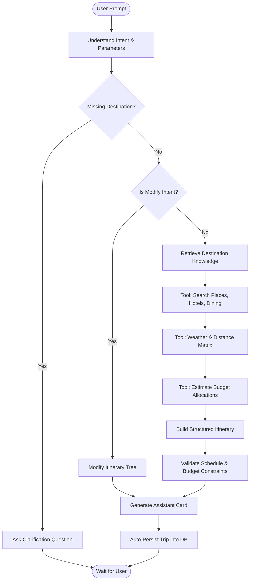

# 🤖 LangGraph Travel Agent Workflow

## StateGraph Design

## Supported Tool Suite (14 Specialized Tools)
1. `search_places(destination, category)`: Fetches rated tourist spots and attractions.
2. `get_place_details(place_name)`: Returns operating hours, entrance tickets, address.
3. `search_hotels(destination, max_price)`: Returns accommodations within target nightly budgets.
4. `search_restaurants(destination, cuisine)`: Finds top local eateries and specialty cuisines.
5. `get_distance(lat1, lon1, lat2, lon2)`: Computes Haversine road/geo distance.
6. `get_travel_time(lat1, lon1, lat2, lon2, mode)`: Calculates transit time with traffic heuristics.
7. `get_weather(destination, duration_days)`: Polls multi-day weather conditions and rain probabilities.
8. `calculate_trip_budget(total_budget, duration_days)`: Allocates category splits and daily limits.
9. `search_destination_knowledge(query, destination)`: Queries vector store for safety rules and transport advice.
10. `get_currency_rate(from_currency, to_currency)`: Multi-currency conversion for foreign budgeting.
11. `save_itinerary(user_id, itinerary)`: Persists complete trip days and activities into database.
12. `update_itinerary(trip_id, updates)`: Updates trip properties.
13. `delete_activity(activity_id)`: Removes activity from itinerary day.
14. `reorder_itinerary(day_id, activity_ids)`: Updates drag-and-drop order indices.
