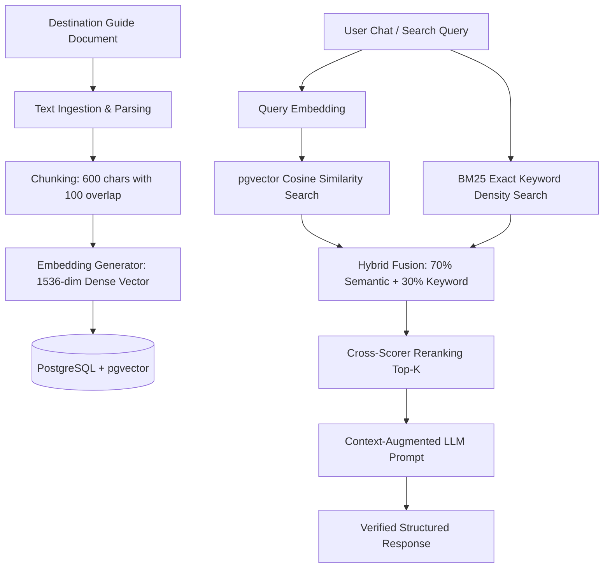

# 📚 Grounded Travel Destination RAG Pipeline

## Architecture Overview

## Features
- **Chunking**: Overlapping chunk strategy preserves context around boundaries and headings.
- **pgvector Cosine Index**: High-performance semantic indexing with fast vector distance calculations.
- **Hybrid Fusion**: Combines vector cosine similarity with exact keyword matching density to eliminate hallucinations on proper nouns, pricing, and locations.
- **Source Citations**: Every retrieved fact attaches document metadata, section titles, and source URLs.
